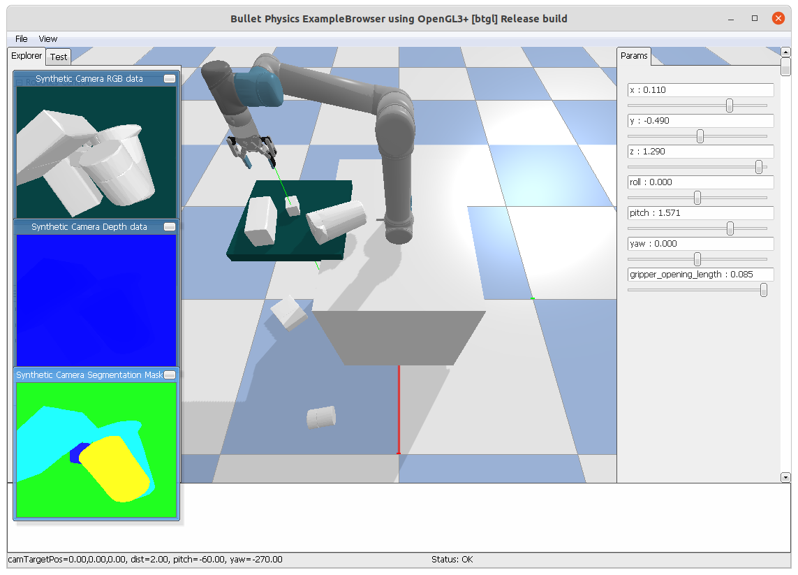

# Gym-Styled UR5 arm with Robotiq-85 / 140 gripper in PyBullet simulator

*Probably the best one among all GitHub repos.*

This repo is under active development. Issues / PRs are welcomed.



## Highlights

- UR5 arm with end-effector 6D IK (Position [X Y Z] and Orientation [R P Y])
- Enhanced Robotiq-85 / 140 gripper, with precise position control and experimental torque control
- Built-in YCB models loader (and obj models after decomposition)
- Gym-styled API, making it suitable for Reinforcement Learning in the field of push-and-grasp
- A heuristic grasping demo
- An interactive user-control demo

## Prerequisite
- Python 3
- PyBullet

## Run

You can try this repo with the interactive user-control demo.
```[Python]
python main.py
```

You can change the XYZ and RPY of the gripper on the right panel.

Press `Z` to close the gripper and `R` to open it.

## Usage

See `heuristic demo` in `main.py`.

###  References
https://github.com/matafela/pybullet_grasp_annotator_robotiq_85

https://github.com/zswang666/pybullet-playground

https://github.com/ros-industrial/robotiq

https://github.com/Alchemist77/pybullet-ur5-equipped-with-robotiq-140

I do not claim copyright for any model files under this repo.
